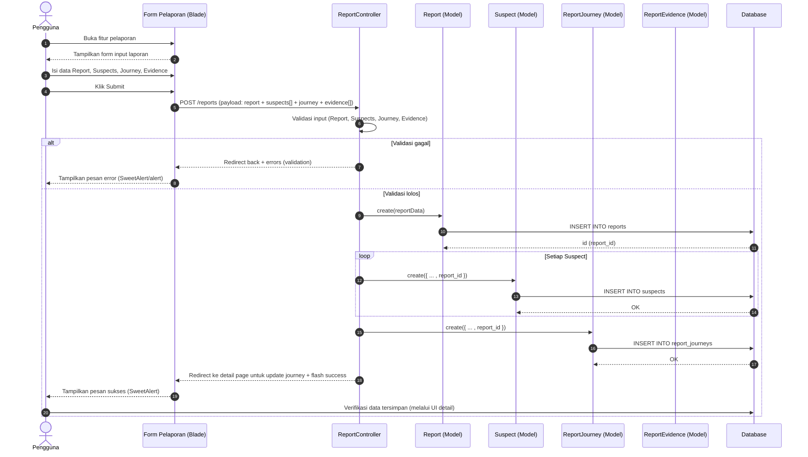

# Sequence Diagram: Fitur Pelaporan

Berdasar dokumen specify di `docs/speckit/pelaporan/specify.md`, berikut sequence diagram mermaid untuk alur penyimpanan data laporan, tersangka, journey, dan evidence.



Catatan:
- Diagram ini menggunakan pendekatan langsung Controller → Model (Eloquent) → Database.
- Jika nantinya ada Service/Repository layer untuk Report, posisinya dapat disisipkan di antara Controller dan Model tanpa mengubah alur utama.
- Tampilkan feedback sukses/gagal menggunakan SweetAlert sesuai integrasi global yang sudah ada.
```